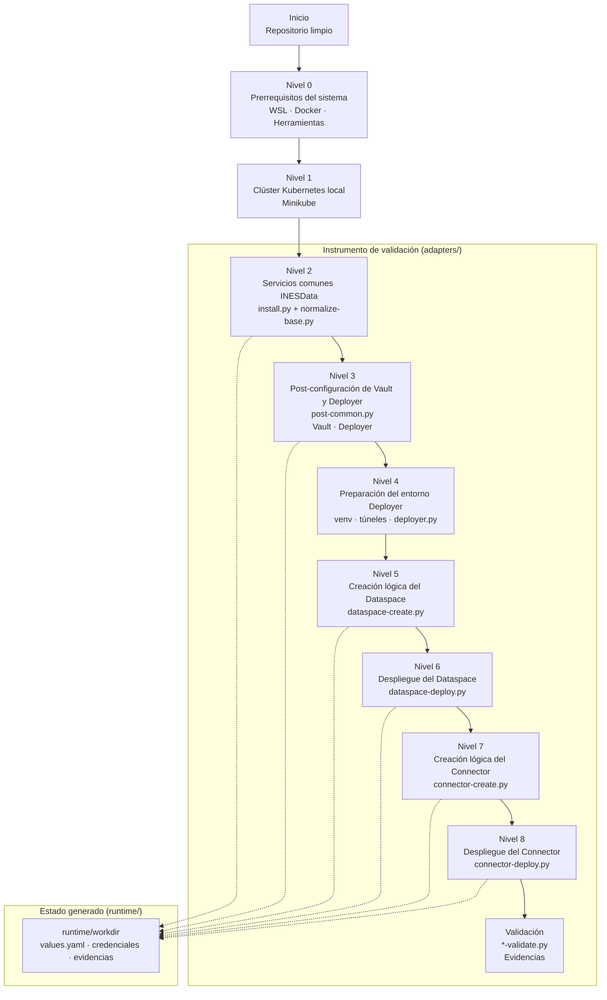

# PIONERA - Entorno reproducible de validación de componentes (A5.2)

## Estado del proyecto

- El entorno definido en este repositorio se encuentra en fase de ejecución de la actividad A5.2 – Validación de componentes del proyecto PIONERA. 
- Su uso se limita al soporte técnico de dicha actividad y no tiene carácter productivo.

## Índice

1. [Características principales](#características-principales)
2. [Arquitectura](#arquitectura)
3. [Requisitos](#requisitos)
4. [Instalación y despliegue reproducible](#instalación-y-despliegue-reproducible)
   1. [Nivel 0 – Prerrequisitos del sistema](/docs/niveles/nivel-0/README.md)
   2. [Nivel 1 – Creación del clúster Kubernetes local (Minikube)](/docs/niveles/nivel-1/README.md)
   3. [Nivel 2 – Instalación base de INESData (servicios comunes)](/docs/niveles/nivel-2/README.md)
   4. [Nivel 3 – Post-configuración de Vault y Deployer](/docs/niveles/nivel-3/README.md)
   5. [Nivel 4 – Preparación del entorno Deployer](/docs/niveles/nivel-4/README.md)
   6. [Nivel 5 – Creación del Dataspace (lógica)](/docs/niveles/nivel-5/README.md)
   7. [Nivel 6 – Despliegue del Dataspace (infraestructura)](/docs/niveles/nivel-6/README.md)
   8. [Nivel 7 – Creación del Connector (lógica)](/docs/niveles/nivel-7/README.md)
   9. [Nivel 8 – Despliegue del Connector (infraestructura)](/docs/niveles/nivel-8/README.md)
5. [Uso y validación del entorno](#uso-y-validación-del-entorno)
6. [Financiación](#financiación)
7. [Autores y contacto](#autores-y-contacto)
8. [Licencia](#licencia)

## Características principales

El entorno de validación definido en este repositorio permite:
- Ejecutar pruebas funcionales sobre componentes individuales.
- Validar escenarios mínimos de integración entre componentes PIONERA.
- Evaluar la interoperabilidad mediante el uso de conectores de espacios de datos.
- Desplegar los escenarios de validación tanto en entornos locales como en máquinas virtuales.
- Generar artefactos y evidencias técnicas reproducibles asociadas a los casos de prueba definidos.

## Arquitectura

La arquitectura del entorno se define como un entorno de validación reproducible orientado a la ejecución controlada de los escenarios de validación de A5.2.

El entorno utiliza INESData como espacio de datos de referencia instrumental y se basa en los siguientes principios:
- Los roles de Provider y Consumer se instancian dentro del espacio de datos.
- Los componentes PIONERA operan fuera del plano de interoperabilidad del espacio de datos.
- El protocolo de interoperabilidad se utiliza exclusivamente para la comunicación entre conectores.
- Los resultados generados por el AI Model Hub quedan fuera del plano del espacio de datos y se consumen a nivel de aplicación mediante APIs.


### Componentes PIONERA

- **Ontology Hub:** gestiona ontologías y modelos semánticos. No consume datasets ni interactúa directamente con componentes de inteligencia artificial.
- **Semantic Virtualizer:** consume datasets instrumentales y aplica semántica. Constituye el único punto de acceso a los datos desde el espacio de datos.
- **AI Model Hub:** consume datos virtualizados una vez autorizado el acceso y ejecuta modelos de inteligencia artificial. Sus resultados quedan fuera del plano de interoperabilidad del espacio de datos.

### Otros elementos

- Los datasets son instrumentales y alimentan exclusivamente al Semantic Virtualizer.
- El Provider Connector accede al Semantic Virtualizer mediante APIs internas (HTTP/SPARQL).
- El protocolo de interoperabilidad se emplea únicamente entre Provider y Consumer.
- Un portal unificado actúa como capa de visualización de resultados de IA y del estado del Consumer, sin participar en los mecanismos del espacio de datos.

### Estructura del repositorio

El repositorio se estructura en torno a la separación de responsabilidades entre automatización, herramientas externas y estado de ejecución:

- `adapters/`: contiene la lógica instrumental de automatización y validación, encargada de orquestar los distintos pasos del entorno de validación e interactuar con espacios de datos externos. Esta carpeta no almacena configuración específica de dataspaces ni estado persistente.
- `runtime/`: se crea dinámicamente durante la ejecución de los scripts y contiene el estado generado y los artefactos resultantes del despliegue y la validación. Entre estos artefactos se incluye el repositorio de despliegue de [INESData](https://github.com/INESData/inesdata-deployment) (`inesdata-deployment`), utilizado como herramienta externa instrumental.
- `docs/`: agrupa la documentación de apoyo y los diagramas de arquitectura, mientras que el directorio `venv/` corresponde al entorno local de ejecución y no forma parte del entorno validado.

### Scripts de automatización y validación

Los scripts de automatización definen el flujo de ejecución del entorno de validación y se organizan por fases, en correspondencia con los niveles definidos en A5.2.

- `bootstrap.py`: inicializa el entorno de trabajo y verifica prerrequisitos básicos.
- `install.py`: despliega los servicios comunes necesarios para INESData.
- `normalize-base.py`: normaliza y prepara la configuración base del despliegue.
- `post-common.py`: ejecuta la post-configuración de servicios comunes (Vault, Deployer).
- `dataspace-create.py`: crea lógicamente un dataspace y genera artefactos de configuración.
- `dataspace-deploy.py`: materializa el dataspace en infraestructura Kubernetes.
- `connector-create.py`: crea lógicamente un conector asociado al dataspace.
- `connector-deploy.py`: despliega el conector en el entorno Kubernetes.
- `validate.py` / *`-validate.py`: ejecutan verificaciones de estado y consistencia del entorno.

### Árbol del repositorio (vista funcional)

```text
pionera_env
├── adapters/
│   └── inesdata/                       # Instrumento de automatización y validación A5.2
│       │
│       ├── bootstrap.py                # Nivel 0 – Verificación de prerrequisitos
│       ├── install.py                  # Nivel 2 – Instalación de servicios comunes
│       │
│       ├── normalize/                  # Normalización y post-configuración
│       │   └── post-common.py           # Nivel 3 – Vault y Deployer
│       │
│       ├── dataspace/                  # Gestión del Dataspace
│       │   ├── dataspace-create.py     # Nivel 5 – Creación lógica
│       │   ├── dataspace-deploy.py     # Nivel 6 – Despliegue infraestructura
│       │   └── dataspace-validate.py   # Validación mínima post-despliegue
│       │
│       ├── connector/                  # Gestión de Conectores
│       │   ├── connector-create.py     # Nivel 7 – Creación lógica
│       │   ├── connector-deploy.py     # Nivel 8 – Despliegue infraestructura
│       │   ├── connector-validate.py         # FASE 1: (Conector 1) Infraestructura 
│       │   ├── connector-crud-validate.py    # FASE 2: (Conector 2) CRUD APIs
│       │   └── connector-flows-validate.py   # FASE 3: (Conector 3) Flujos E2E
│       │
│       ├── validate.py                 # Orquestador de validaciones
│       │
│       └── lib/                        # Utilidades comunes (kubectl, helm, helpers)
│
├── docs/                               # Documentación y diagramas
│   └── niveles/                        # README por nivel de instalación de INESData (navegable)
│       ├── nivel-0/
│       ├── nivel-1/
│       ├── ...
│       └── nivel-8/
│
├── runtime/                            # Estado generado durante la ejecución
│   └── workdir/
│       └── inesdata-deployment/        # Repositorio externo INESData (instrumental)
│
└── venv/                               # Entorno virtual local (fuera del alcance A5.2)

```
Las fases de validación CRUD y flujos se incluyen como estructura prevista, aunque su implementación funcional se realizará de forma incremental conforme avance la validación de interoperabilidad.

Los contenidos bajo `runtime/` se generan dinámicamente durante la ejecución y constituyen parte de las evidencias técnicas de la validación.

## Requisitos
Las siguientes herramientas deben estar instaladas y accesibles desde la terminal:
- Docker Desktop (en ejecución)
- kubectl
- Minikube
- Helm
- **Python 3.10**  
  Instalado siguiendo la guía externa utilizada en este entorno:  
  [Guía de instalación de Python 3.10 en Linux/WSL](https://gist.github.com/rutcreate/c0041e842f858ceb455b748809763ddb)

## Instalación y despliegue reproducible

Este repositorio describe el flujo general del entorno técnico utilizado para la validación de los componentes del proyecto PIONERA en el marco de una arquitectura de espacios de datos. El entorno se concibe como un instrumento de apoyo a la validación y permite configurar y ejecutar escenarios controlados de prueba sobre los componentes desarrollados.

A continuación, se describe el flujo completo, reproducible y mayoritariamente automatizado para desplegar un demo de INESData en un entorno de pruebas basado en WSL, habilitado en el sistema anfitrión. INESData se integra en el ecosistema PIONERA como espacio de datos de referencia instrumental para la validación técnica de componentes en la actividad A5.2.

### Flujo de ejecución del entorno de validación



### Convenciones usadas

- **Ruta**: directorio desde el que deben ejecutarse los comandos indicados
- **Comando**: acción a ejecutar en la terminal
- **Salida esperada**: estado o resultado observable que confirma la correcta ejecución del paso
- **Propósito**: justificación técnica del paso dentro del flujo de validación

### Configuración del entorno local (hosts)

Para los despliegues locales del ambiente de pruebas, algunos servicios de INESData (por ejemplo, Keycloak, MinIO y los endpoints del conector) esperan que ciertos nombres de host estén disponibles mediante resolución DNS.

En un entorno productivo, esta resolución se realizaría a través de la infraestructura DNS del clúster.  
En el ambiente de pruebas A5.2, esta resolución se simula de forma local mediante el fichero `hosts`.

Es necesario añadir las siguientes entradas al fichero `hosts` del sistema:

### Linux / macOS
Editar el fichero `/etc/hosts`

### Windows
Editar el fichero `C:\Windows\System32\drivers\etc\hosts`

```text
# Permite que el mismo contexto de Kubernetes funcione tanto desde el host como desde contenedores Docker:
127.0.0.1 kubernetes.docker.internal

# Fin de la sección
127.0.0.1   keycloak.dev.ed.inesdata.upm
127.0.0.1   keycloak-admin.dev.ed.inesdata.upm
127.0.0.1   minio.dev.ed.inesdata.upm
127.0.0.1   console.minio-s3.dev.ed.inesdata.upm
127.0.0.1   registration-service-demo.dev.ds.inesdata.upm
127.0.0.1   conn-oeg-demo.dev.ds.inesdata.upm
```

## Uso y validación del entorno

El uso del entorno de validación y la ejecución de pruebas mínimas se realizan de forma incremental siguiendo los niveles definidos en A5.2.

Cada nivel documenta:
- los pasos de ejecución,
- los mecanismos de verificación,
- los artefactos generados,
- y los criterios de aceptación asociados.

Para una descripción detallada, consultar la documentación específica de cada nivel en `docs/niveles/`.

## Financiación

This work has received funding from the **PIONERA project** (Enhancing interoperability in data spaces through artificial intelligence), a project funded in the context of the call for Technological Products and Services for Data Spaces of the Ministry for Digital Transformation and Public Administration within the framework of the PRTR funded by the European Union (NextGenerationEU).

<div align="center">
  
</div>

---

## Autores y contacto

- **Mantenedor:** Adrian Vargas
- **Contacto:** 
  - adrian.vargas@upm.es

## Licencia

PioneraEnv is available under the **[Apache License 2.0](https://github.com/ProyectoPIONERA/pionera_env/blob/main/LICENSE)**.